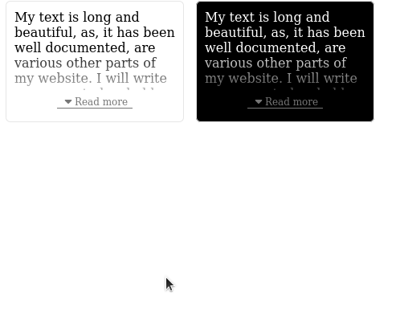

[](https://www.npmjs.com/package/react-expandable-content) [](https://github.com/Logora/react-expandable-content/blob/master/LICENSE.md) [](https://npmcharts.com/compare/react-expandable-content)

## react-expandable-content
React component to enable text collapse based on a certain height



## Table of Contents

- [Installation](#installation)
- [Usage](#usage)
- [Examples](#examples)
- [Props](#props)
- [Styling and Customization](#styling-and-customization)
- [License](#license)
- [Contributors](#contributors)

## Installation

Install via npm or yarn

```javascript
npm install react-expandable-content --save

yarn add react-expandable-content
```

## Usage

ExpandableContent can receive any HTML elements or React components as its children.

```javascript
import React from 'react';
import ExpandableContent from 'react-expandable-content';

const App = () => {
  return (
    <ExpandableContent maxHeight={100} collapseText={"Read less"} expandText={"Read more"}>
      <p>
        This content will be collapsed. It can be any kind of HTML or React components.
      </p>
      <p>
        Another section that will be collapsed.
      </p>
    </ExpandableContent>
  );
};

export default App;
```

## Examples

[Code Examples](https://github.com/Logora/react-expandable-content/blob/master/examples/default.js)

## Props

| **props** 	| **default**  	|  **type** 	| **usage** |
|---	|---	|---	|---  |
|  expandable	|  true 	| boolean 	| Enable content to be expanded    |
|  expandText 	|  "Read more" 	|  string 	|  Text to display when content is collapsed    |
|  collapseText 	|   "Read less"	|  string 	| Text to display when content is expanded    |
|  className 	|   :x:	|  string 	| CSS class applied to the expandable part |
|  maxHeight 	|   100	|  integer 	| Max height in pixels for your collapsed content  |
|  showIcon 	|   true	|  boolean 	| Whether the dropdown icon should be displayed    |
|  onCollapse 	|  :x: 	|  func 	| Callback function triggered when content is collapsed    |
|  onExpand 	|   :x:	|  func 	| Callback function triggered when content is expanded     |
|  darkMode 	|   false	|  boolean 	| Enabling dark mode on your content (black background)    |

## License

MIT

## Contributors

<a href="https://github.com/Logora/react-expandable-content/graphs/contributors">
  
</a>
